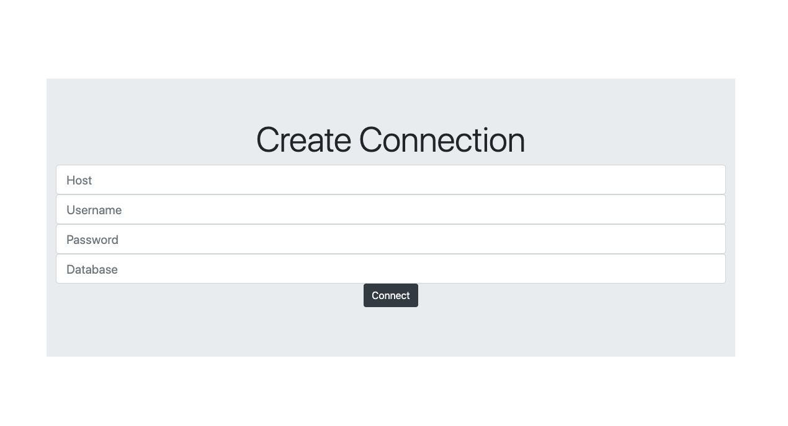
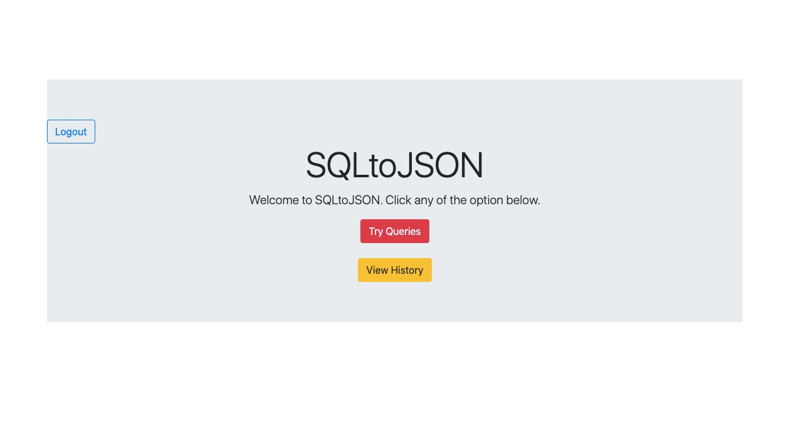
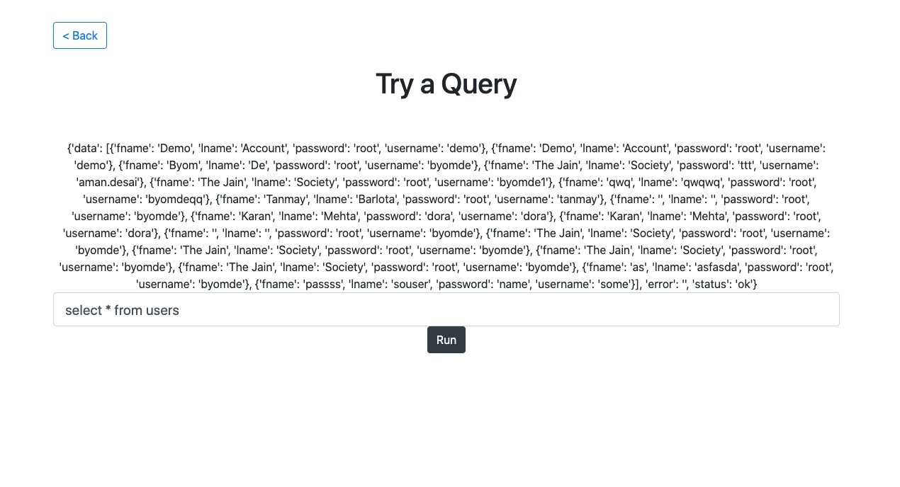
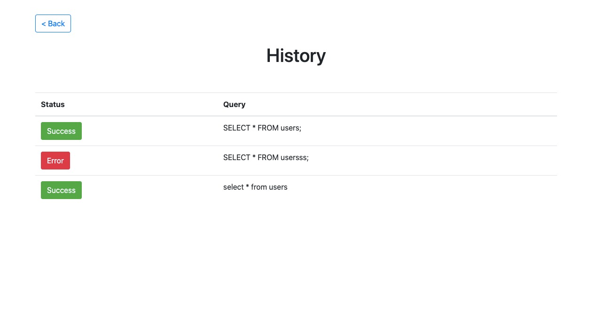

<h1 align="center">SQLtoJSON</h1>
<div align="center">
<br>
&nbsp;&nbsp;&nbsp;  

<br>
</div>
<h3> Meet this amazing middleware for your MySQL operations. </h3>

<b>Just a Single line to connect and single line to execute, and boom! You have your response in JSON.</b><br>
<strong> Say Good Bye to Cursors, Connections, MySQL Drivers. This package has everything covered. And that is not the best part.</strong><br>

Best part is you get an easy to use web interface where you can see your "in-code" query history and try new queries.
Wanna change DB connection? Again, this package has got you covered. 

<h2> Usage </h2>

```Python
from pypackage import s2j

# This line connnects you to your database. All exceptions self handled. ;)
db = s2j.s2j("localhost", "root", "password", "database") 

# Now one liners for your queries!!!!!!
response = db.execQuery("SELECT * FROM users;")

# You get an array in data field containing data as indivisual dictionary objects, key being column name.
print(response['data'])

# Use this method to fireup Web Interface. And the server will be initiated on PORT 4001
s2j.start_lookup_server(db)
```

<h3>Screenshots of Web Interfaces</h3>
<hr>




